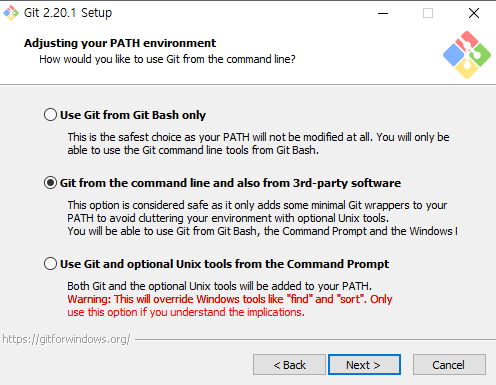

# Git

[TOC]

# 1. GitHub 가입 및 로그인 

## 1) GitHub

- url : www.github.com
- GitHub login (신규 생성시 Create an account 클릭후 회원가입)

- GitHub repositories 생성

- GitHub url 생성

- GitHub url 복사(git remote 등록시 필요) 

# 2. 윈도우 git 설치 

## 1) Git설치

- url : https://www.git-scm.com/downloads
- downloads window 클릭

- downloads window 다운

- window git 설치1

- window git 설치2
 

- window git 설치3
 

- window git 설치4
 

- window git 설치5
 

- window git 설치6
 

- window git 설치7
 

- window git 설치8
 

- window git 설치9
 

- window git 설치10
 

- gitbash 실행
 

- gitbash 화면
 